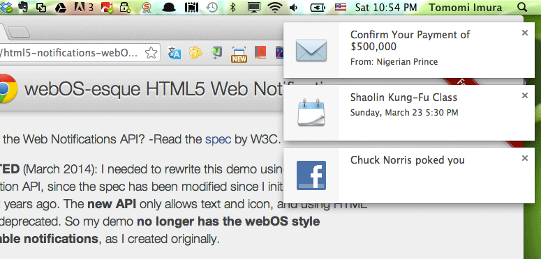

# Web Notifications Demo v2

W3C Web Notifications API demo in webOS UI style.

In the original demo, I implemented the notifications with webOS style, which allowed a user to swipe to close the window. However, this v2 demo no longer supports the swipable notifications because the simplified new Web Notifications spcification only allows text and icon, and external HTML files are no longer permitted.

## Supported Browsers

- Firefox 22+ (both desktop and mobile)
- Chrome 32+ (Desktop only)

## Demo

[girliemac.github.com/html5-notifications-webOS-style](http://girliemac.github.com/html5-notifications-webOS-style)

## History

- v.2 (March 2014) - using the [new Web Notification API specs](http://www.w3.org/TR/notifications)
- v.1 (March 2012) - using the old Web Notification API specs, which is now deprecated.

For detailed changelog, check [Releases](https://github.com/girliemac/html5-notifications-webOS-style/releases).

## Known Problems

- Chrome for Android does not support the feature
- Firefox on Android does support, however, only one line (the last line) is displayed on the native notification bar on top. No extra UI or window from browser.
- On Chrome (tested on 33), `close()` method does not seem to work. Notification windows fails to close automatically. 

### Firefox on Android

Notifications appear in the native notification bar, one at a time, instead of popup windows from browser. 

The problem is that if a notificatin contains more than one lines one messages (when both `title` and `body` are set), only the last line (`body`) is displayed.

Also, custom icons aren't shown either. The icon on the notification bar is always Firefox icon.

